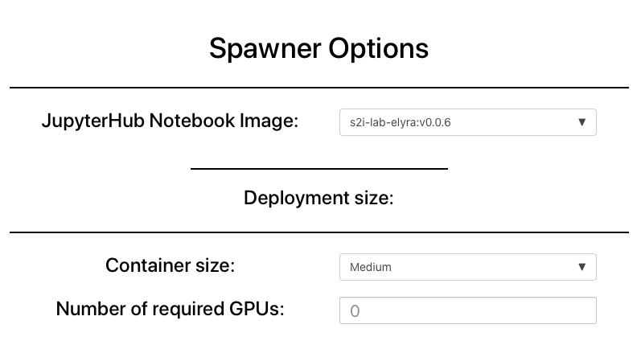
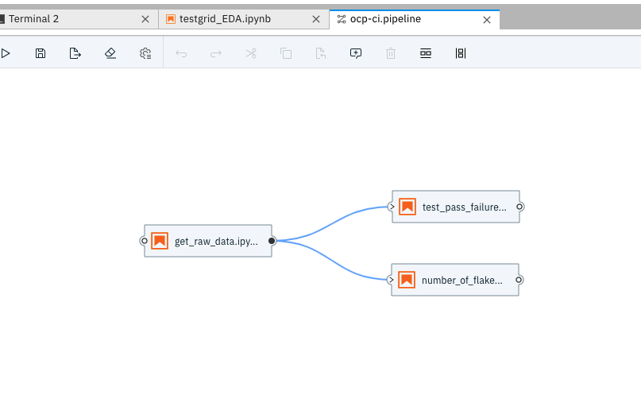
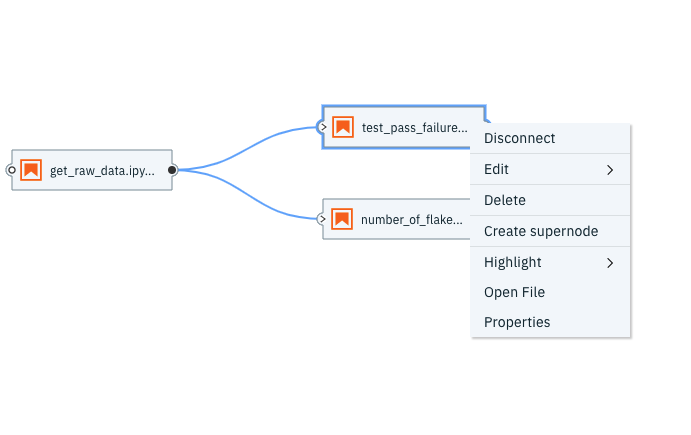
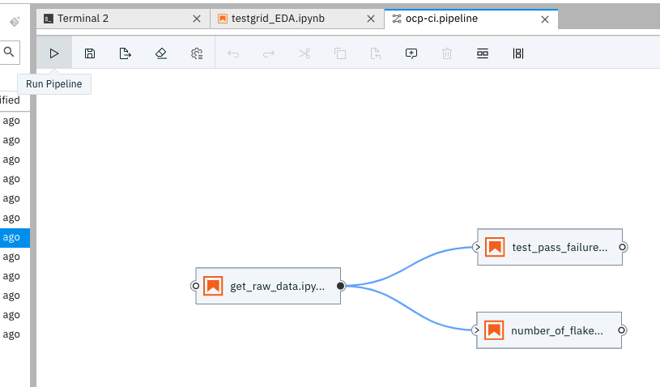
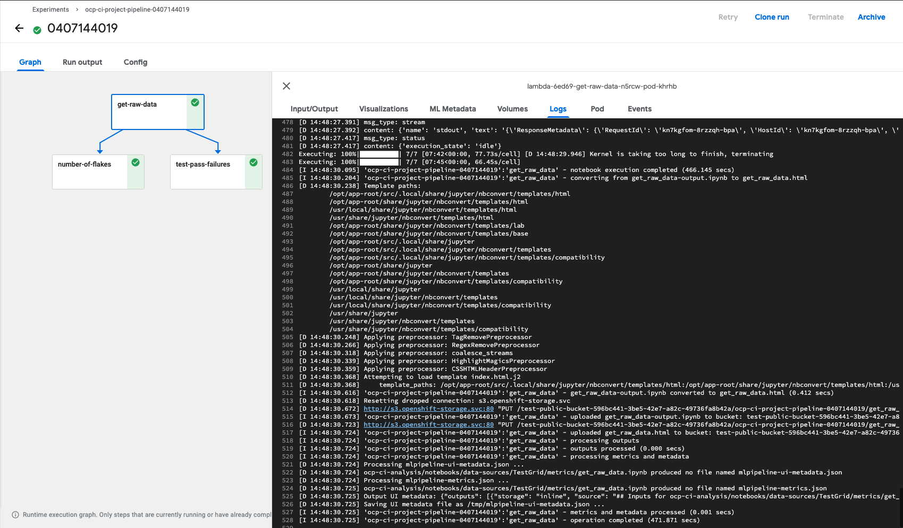

# Running a Kubeflow Workflow using Elyra

## Background

For our data science workflows, we use Jupyter notebooks for data collection, model training and all parts of the machine learning workflow. Some of those tasks are performed sequentially and continuously, requiring us to automate the sequential running of the notebooks using a simple workflow.

Using the [Elyra](https://github.com/elyra-ai/elyra) JupyterLab and the notebook pipelines visual editor, we can create and run our notebooks using Kubeflow Pipelines, which is a platform for building and deploying scalable machine learning (ML) workflows.

An instance of Kubeflow Pipelines is available for use in Operate First.

In this example, we automate a sample Kubeflow workflow using the Elyra UI for the OCP CI Analysis Project.

## Pre-Requisites

1. **Notebook Formatting for Automation**

    * Data Stored in S3 - For notebooks to run in automation and communicate with one another, we store and read the data to and from an S3 bucket.
    * Automation Flags - The automation flags in the notebook ensure that when the environment variable is configured for AUTOMATION, the notebook reads and writes from S3.

2. **Project Image** - We need to tag a new release for the project for the latest set of dependencies. We have the latest image available at `quay.io/aicoe/ocp-ci-analysis:latest`. For more information on using the AICoE tooling to tag a release and for using separate overlays for each notebook, you can go [here](https://github.com/thoth-station/elyra-aidevsecops-tutorial/blob/master/docs/source/build-images.md)

3. **Operate First KFP endpoint** - For Operate First we can find the Kubeflow Pipeline UI at this [link](http://istio-ingressgateway-istio-system.apps.zero.massopen.cloud/pipeline/#/). More information on accessing and using Kubeflow Pipelines can be found [here](https://www.operate-first.cloud/users/apps/docs/kubeflow/kubeflow-pipelines/README.md).

## Steps to Run Pipeline

1. To access the Elyra UI, you can launch the Elyra 0.0.6 image on the Operate First MOC [JupyterHub](https://jupyterhub-opf-jupyterhub.apps.zero.massopen.cloud/hub/spawn)



2. Clone the [ocp-ci-analysis](https://github.com/aicoe-aiops/ocp-ci-analysis) repository and select notebooks which satisfy the automation template.

3. Using the Thoth bots and AICoE pipeline, we have tagged a new release for the project and pushed the latest image for the project to the project’s Quay registry available at `quay.io/aicoe/ocp-ci-analysis:latest` . This image contains the project-wide dependencies.

4. As the image is available on the registry, we will now add it to the Elyra metadata using the command line using the following command. This can also be done usind the UI, and we can also add separate [overlays](https://github.com/thoth-station/elyra-aidevsecops-tutorial/blob/master/docs/source/build-images.md#use-of-overlays) for each notebook.

```
elyra-metadata install runtime-images --display_name="OCP-CI-Project-Workflow" --description="OCP CI Project Workflow" --image_name="quay.io/aicoe/ocp-ci-analysis:latest"
```

5. Next we will create a runtime to be used in the Kubeflow pipeline using the CLI using the following command. This can also be done using the UI.

```
elyra-metadata install runtimes --display_name="KFP operate first" --api_endpoint="http://istio-ingressgateway-istio-system.apps.zero.massopen.cloud/pipeline" --schema_name=kfp --engine=Tekton --cos_endpoint=CLOUD_OBJECT_STORAGE_ENDPOINT --cos_username=CLOUD_OBJECT_STORAGE_USERNAME --cos_password=CLOUD_OBJECT_STORAGE_PASSWORD --cos_bucket=CLOUD_OBJECT_BUCKET_NAME
```

6. Once we have created the runtime, we will open a new Elyra Pipeline Editor (by Ctrl + Shift + C ) and drag and drop notebooks which we want to add to the pipeline and connect them in the sequence we want them to run in.




7. Insert inputs for each step/notebook in terms of image runtime, environment variables and resources by going to "Properties".



Any dependencies on other python files and notebooks can be specified here. The files must be present within the same directory.
The metric notebooks here are dependent on the `metric_template` notebook and hence we specify that as a dependency.


We can also check the `.pipeline` file that was created to check that whether it reflects the parameters we set.

8. Once that is done, we save the Pipeline and trigger the pipeline by hitting run.



9. We can now switch over to the deployed [Kubeflow instance](http://istio-ingressgateway-istio-system.apps.zero.massopen.cloud/pipeline/#/experiments) to debug the pipeline.

10. Under Experiments, clicking on the latest Experiment name will take you to the Run name. Clicking on the Run Name and the individual Step will take you to Logs, which can be helpful in debugging any failing runs.


