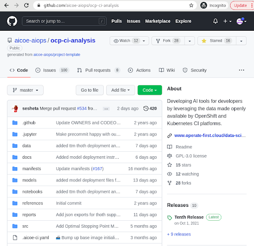
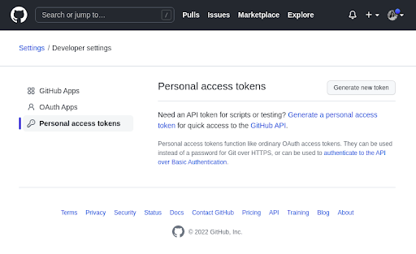

# Set up Github environment

In order to get started with the workshop, it's vital to have a github account, so you can also interact with the codebase and make changes as and when required. Here are a few steps that you need to follow along to be all set to get started with this workshop.

* **Create a Github account**: Go to[ github.com](https://github.com/) and click on `Sign Up` to create a new account.

* **Fork the repository:** After creating your account, you need to access the AI4CI repository to interact with the code. In order to do so, go to the [AI4CI repository](https://github.com/aicoe-aiops/ocp-ci-analysis) and fork the repository by clicking on the `fork` button In the top-right corner of the page.

* **Generate Github Access token:** Go to [ settings -> token](https://github.com/settings/tokens), click on **generate token**, and copy the personal access token now. You will not be able to see it again.

