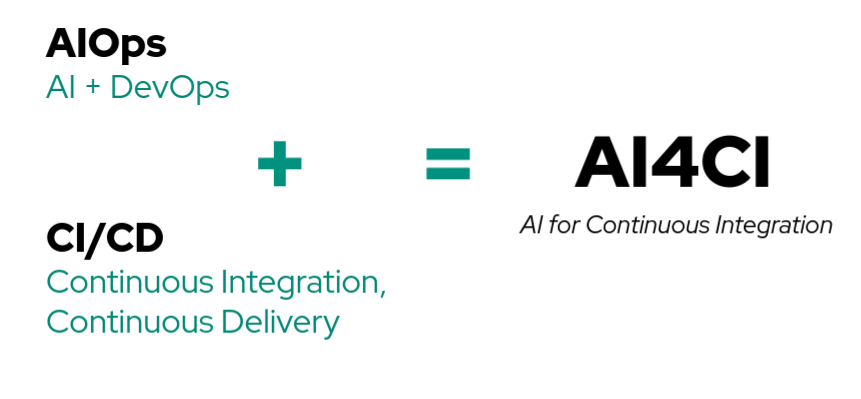

# Introduction

[Slides for the Workshop](../intro_to_workshop_devconf22.pdf)

## Introduction to AIOps

AIOps stands for Artificial Intelligence for IT Operations. AIOps is a critical component of supporting any Open Hybrid Cloud infrastructure. AIOps involves using big data processing, machine learning and AI tooling to support IT operations. Some common examples of AIOps tools are anomaly detection, correlation analysis, time-to-response prediction, log analysis. Tools such as these can help facilitate collaboration between data science practitioners and DevOps engineers and help with streamlining incident management, issue resolution and faster root cause analysis.

## Introduction to AI4CI

Continuous integration (CI) is the practice of automating the integration of code changes from multiple contributors into a single software project. CI/CD is a method to frequently deliver applications to customers by introducing automation into the stages of app development.

And, **AI4CI** is AI applied to CI/CD data. It a collection of AIOps tools that can support IT operations. It consists of tooling that includes ML services, KPI & Metric dashboards can can provide greater visibility into CI/CD processes. The aim of the AI for continuous integration(AI4CI) project is to build an open AIOps community involved in developing, integrating and operating AI tools for CI by leveraging the open data that has been made available by OpenShift, Kubernetes and others.

## Introduction to Operate First

[Operate First](https://www.operate-first.cloud/) is an initiative to “operate” software in a production-grade environment - bringing users, developers and operators closer together.  It uses the same community-building process of open-source projects, but extended to ops procedures and data. Operate First enables collaboration between open source developers and cloud providers, and AIOps supports this collaboration by creating a new set of tools around CI/CD processes, which could otherwise be a pain point during the development and production of open source projects.
