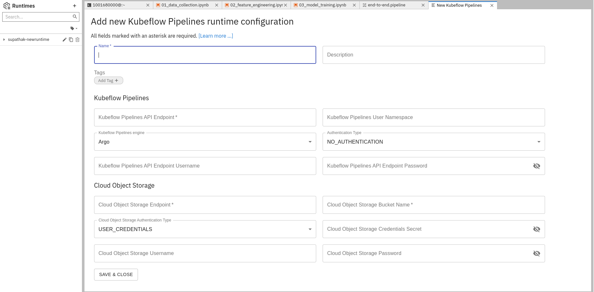
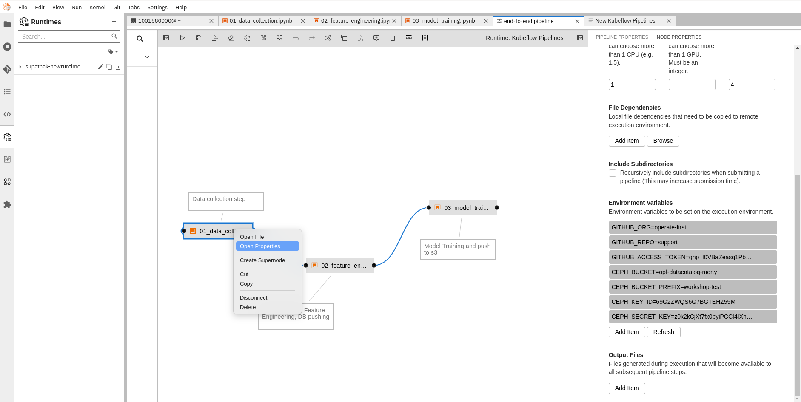
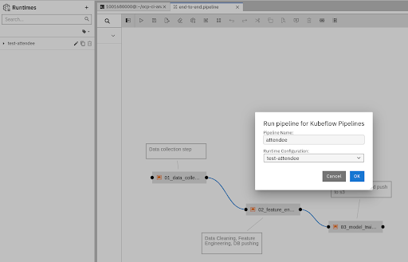
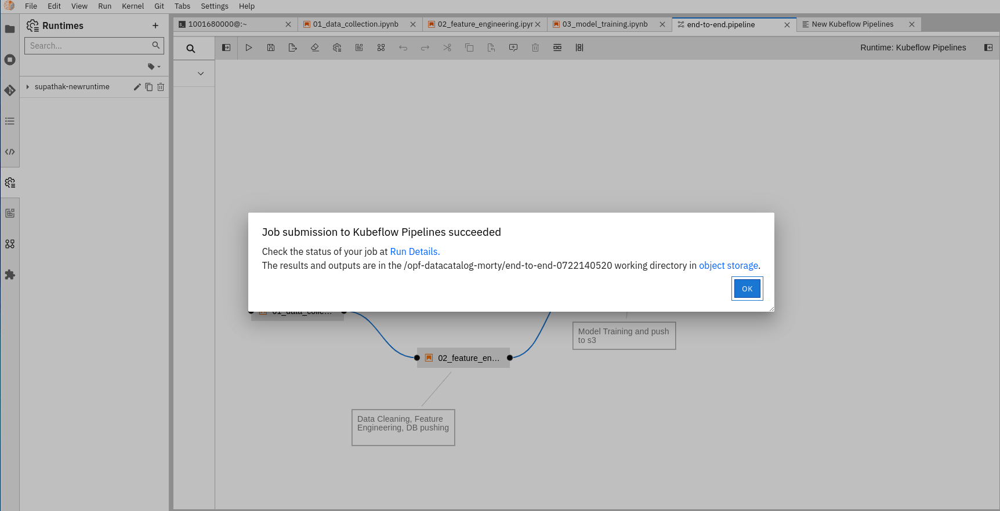
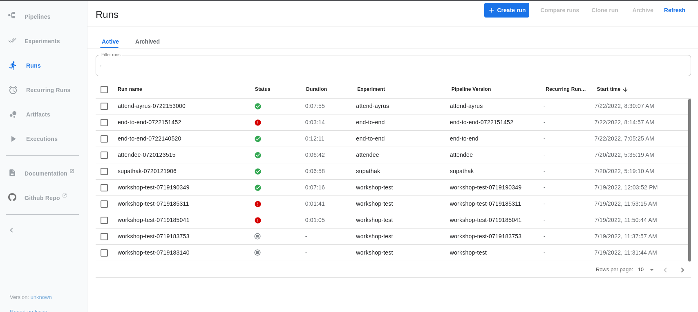
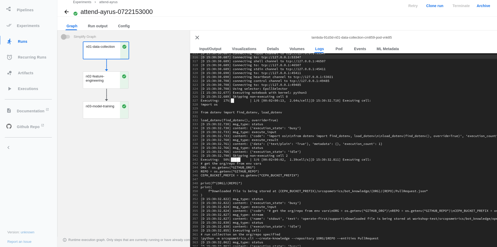
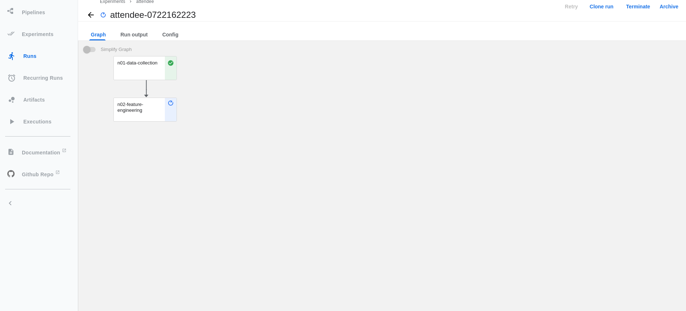
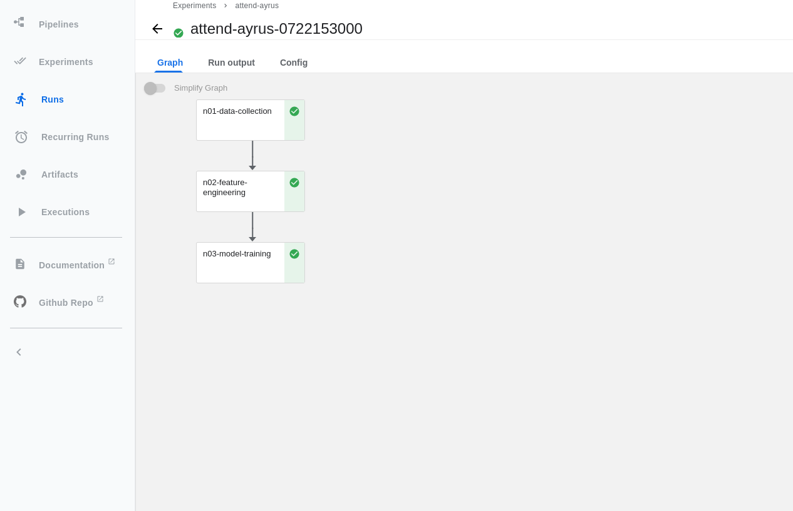

# Create an ML Pipeline using Elyra and Kubeflow Pipelines

In this section, we will learn how to run the training pipeline of the ML model in automation. To learn more about the training process, refer to the chapter on [Model Development](https://aicoe-aiops.github.io/ocp-ci-analysis/docs/workshop/model_development.html). In order to run te above notebooks in automation, we use [Kubeflow Pipelines](https://www.kubeflow.org/docs/components/pipelines/introduction/) and [elyra notebook pipelines visual editor](https://elyra.readthedocs.io/en/stable/).

## Create kubeflow runtime configuration

As a first step, create a Kubeflow runtime configuration. In order to do that

Click the Runtimes icon on the left hand side toolbar. Click the ‘+’ on the top right to create a new runtime configuration and select “New Kubeflow Pipelines Runtime configuration”. Fill in the following:

* **Name**: Give the runtime configuration your Github username eg: oindrillac
* **Kubeflow Pipelines API Endpoint:** [http://ml-pipeline-ui.kubeflow.svc.cluster.local/](http://ml-pipeline-ui.kubeflow.svc.cluster.local/)
* **Kubeflow Pipelines Engine:** Tekton
* **Authentication Type:** No Authentication
* **Cloud Object Storage Endpoint:** S3 Endpoint
* **Cloud Object Storage Bucket Name:** S3 Bucket Name
* **Cloud Object Storage Authentication Type:** KUBERNETES_SECRET
* **Cloud Object Storage Credentials Secret:** aiops-tools-workshop-s3
* **Cloud Object Storage Username:** AWS Access Key ID
* **Cloud Object Storage Password:** AWS Secret Key

## Configure Pipeline

Open pipeline(end-to-end.pipeline) and click on each node and click on “Open Properties”. Fill in the environment variables which are not pre-filled for each notebook and hit “save” to save the pipeline

## Run pipeline

To run the pipeline, click on the “Run” icon on the top toolbar and give the pipeline any **name** (recommended that you use your github username so that it's easier to debug later) and select the kubeflow runtime configuration that you created earlier and hit Submit.

## View running pipeline

Once the pipeline has been submitted, to view the running pipeline in the Kubeflow UI, go to [https://ml-pipeline-ui-kubeflow.apps.smaug.na.operate-first.cloud/#/runs](https://ml-pipeline-ui-kubeflow.apps.smaug.na.operate-first.cloud/#/runs)

And click on the run with your username (or the **name** you provided it).

The Notebooks should look like this while running. To debug the notebooks and view logs while running the notebooks, click on the Node and go to Logs.

Once the Notebooks have run successfully, they should look like this.

