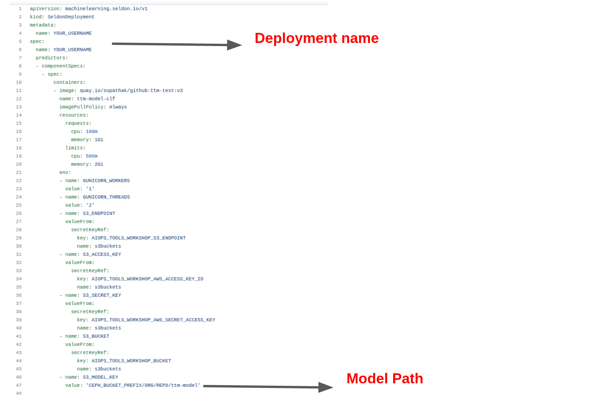
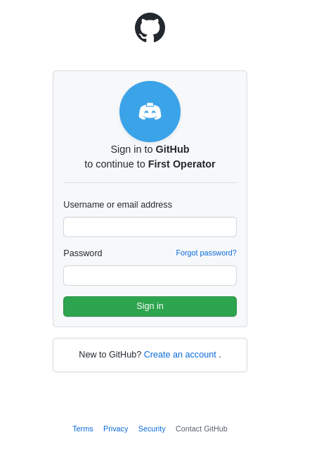
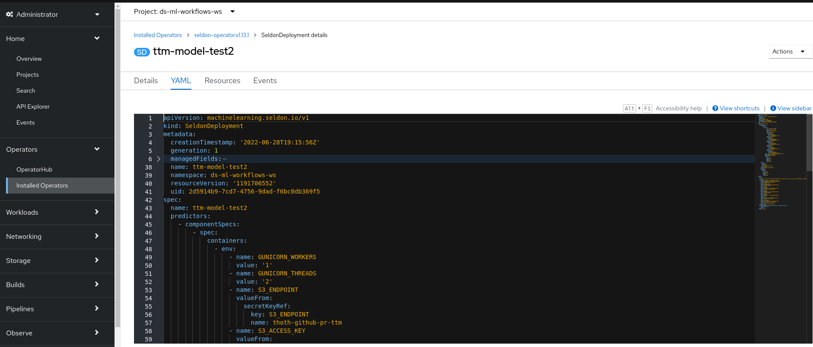
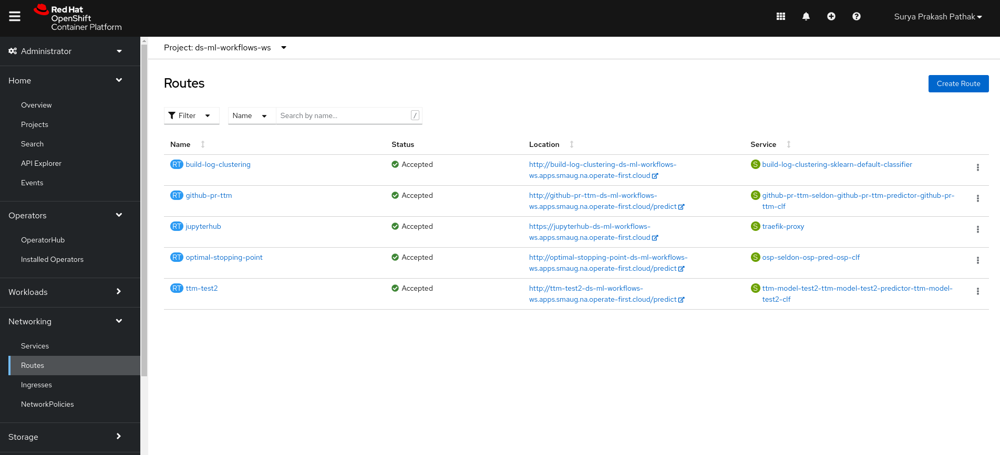

# Model Deployment

Once you complete the process of feature engineering and model training and come up with the best possible model. It is now time to deploy your model as a service. We use [Seldon](https://docs.seldon.io/projects/seldon-core/en/latest/wrappers/s2i.html) Operator on Red Hat OpenShift in order to create an endpoint which can be accessed from a terminal or jupyter notebook or can even be integrated with a bot which can directly comment on your new pull request.

In order to deploy your model,

1. Fork the repo containing the [deployment-config](https://github.com/aicoe-aiops/ocp-ci-analysis/blob/master/notebooks/time-to-merge-prediction/workshop/deployment-config.yaml) file (You might have already done this step). Now change the a. Deployment name and b. Model Path, in the config file (as seen in the image below) and push it to your origin repo (`git push`).You will be using this config file to create Seldon Deployment.

2. Go to [OpenShift console](https://console-openshift-console.apps.smaug.na.operate-first.cloud/k8s/ns/aiops-tools-workshop/routes) and login through Operate First and your GitHub username/email and password.

3.Once you sign in, go to Operators -> Seldon Operators (you can use the search bar to search for the Operator)

4. Now in the Seldon Operator. Go to Seldon Deployment.

Here you can see the list of different Seldon Deployments.

5. In order to create a new deployment, click on "Create SeldonDeployment". After that click on "YAML view"

6. In the YAML view, you need to update the yaml file with the deployment config file you have created. You copy the contents from deployment config file from your forked repo and paste it here. Once you paste it, you click to create your deployment file.

7. Now once you create your deployment file, check the status of the deployment file you have created from the status bar shown in the image below. You can also check the running Pods that are created as a result of your deployment.

8. Once you create your deployment. Next step is to create a route to get the endpoints. In order to go to routes, click on "Networking" -> Routes.

Here you can again see the list of different routes for different services. In order to create your own, click on "Create Route" and create a custom service by adding details like such:

- **Name** : You can give any name you like
- **Host name** : It will be generated later. No need to write.
- **Path** : /predict
- **Service** : It is the classifier service from the yaml file created while creating Seldon Deployments. You can select that service from the drop down. If you need to check it, you can go to services and clicking on it will show us the owner of the service.
- **Target Service** : After you select your service, you should see the target port to be either 9000/6000/5000. You can select 9000.

9. Now click to create a service. Once you do that. Your route will be created which contains model endpoint location.

Great!! You just deployed a custom model with Seldon.

Now, copy the created route from the section where it says Location, and we will use this model endpoint in the [model inference](https://github.com/aicoe-aiops/ocp-ci-analysis/blob/master/notebooks/time-to-merge-prediction/thoth-station/thoth_model_inference.ipynb) notebook and predict the outcome.
