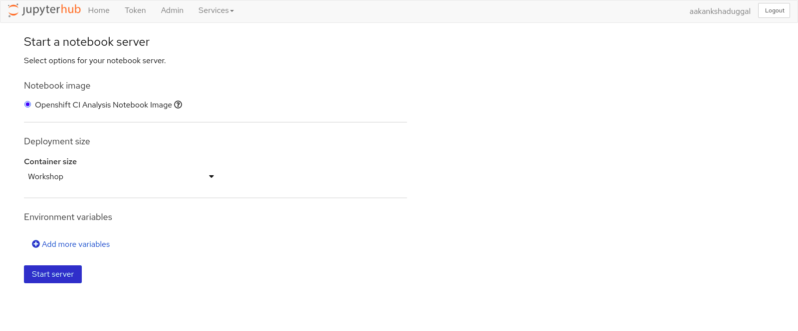
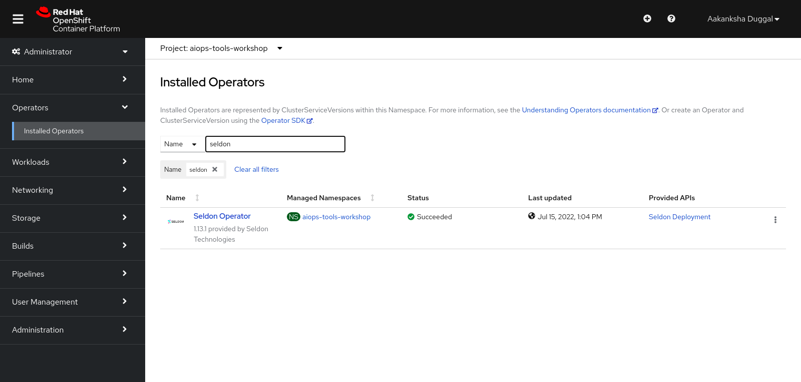

# Onboarding

Hello and welcome to the workshop on building a simple AIOps tool on the [Operate First cloud](https://www.operate-first.cloud/) and learning how to move your AI workloads to the cloud by implementing an end-to-end ML tool.

In this workshop, you will learn how to collect data from an open CI/CD data source, use Jupyterlab and its extensions to manage dependencies, and run jupyter notebooks. You will learn how to perform automated, repeatable experiments using Elyra and Kubeflow Pipelines, create and deploy machine learning modes on OpenShift using Seldon and visualize results on a Superset dashboard.

## Access Services on Operate First

### Step 1: Create Github Account

In order to get started with the workshop, it's vital to have a github account, so please create a github account.

Go to[ github.com](https://github.com/) and click on `Sign Up` to create a new account.

### Step 2: Get added to the cluster

To get access to the services please add your github username [here](https://etherpad.opendev.org/p/workshop_scale_2022), and you will be provided access.

### Step 3: Try out the Services

To get started with this tour, let’s first introduce you to the various tools that are available on Operate First environment and will help us in building the AIOps application using Operate First.

1. **Openshift Console -**

For this workshop, we will start by logging in to the [Openshift Console](https://console-openshift-console.apps.smaug.na.operate-first.cloud/k8s/ns/aiops-tools-workshop/routes).

Select login with `operate-first`, and login into the cluster by using your Github credentials.

2. **Ceph S3 storage -**

Ceph provides a unified storage service with an object, block, and file interface from a single cluster built from commodity hardware components. Operate First hosts a public ceph storage bucket that is accessible by anyone. You can find the credentials and other information for this bucket [here](https://vault.bitwarden.com/#/send/zTA4PuNJwEW6kq7ZAUnY8g/pf51QZhZcEQ4QCEN7Lbszw).

To get the password to this vault, please check with the workshop organizers during the workshop.

**_Some things to note:_**

* Do NOT store any confidential information on this bucket as it is open to the public.
* Always back up all your data regularly, as anyone can go in and wipe it.

3. **Jupyterhub -**

JupyterHub is the best way to serve Jupyter notebook for multiple users. It is a multi-user Hub that spawns, manages, and proxies multiple instances of the single-user Jupyter notebook server. Access to operate first JupyterHub is open to the public. All you need is a GitHub account.

* Our JupyterHub instance on the smaug cluster can be found [here](https://jupyterhub-aiops-tools-workshop.apps.smaug.na.operate-first.cloud/).
* Login using the operate-first option, and you will be redirected to the JH spawner UI.

* For this workshop, we will be working with the `Openshift CI Analysis Notebook Image` image.
* Select a suitable container size for the server,for this workshop choose `Workshop` , and start the server.

4. **Seldon -**

[Seldon](https://docs.seldon.io/projects/seldon-core/en/latest/wrappers/s2i.html) provides a set of tools for deploying machine learning models at scale. We will use the Seldon operator on Red Hat Openshift to :

- Deploy machine learning models in the cloud or on-premise.

- Create an endpoint that can be accessed from terminal or Jupyter Notebook.

- Get metrics and ensure proper governance and compliance for your running machine learning models.

In order to access Seldon on Red Hat Openshift, you will need to go to the [Openshift Console](https://console-openshift-console.apps.smaug.na.operate-first.cloud/k8s/ns/aiops-tools-workshop/routes) and go to `Operators` and search for `Seldon Operator`.

5. **Trino -**

[Trino](https://trino-aiops-tools-workshop.apps.smaug.na.operate-first.cloud/) is a distributed SQL query engine designed to query large data sets distributed over one or more heterogeneous data sources. Since our data is stored in Ceph, the Operate First Trino is currently configured to use the `opf-datacatalog-bucket` S3 bucket.

After extracting and analyzing the data in Jupyterhub, we use Trino to store our datasets in the database to further interact with it via Cloudbeaver and Superset.

6. **Cloudbeaver -**

[CloudBeaver](http://cloudbeaver-aiops-tools-workshop.apps.smaug.na.operate-first.cloud/) is a popular web application that provides a rich UI for working and interacting with SQL databases. The data we exported by using Trino can be accessed in the [CloudBeaver UI](http://cloudbeaver-aiops-tools-workshop.apps.smaug.na.operate-first.cloud/) and can be queried by SQL queries.

7. **Superset -**

After creating the tables in Trino, we can start creating our dashboards in Superset. Apache Superset is an open source visualization tool that allows users to create interactive dashboards. [Superset](https://superset-aiops-tools-workshop.apps.smaug.na.operate-first.cloud/) is very simple to use and may require some basic knowledge about SQL.
