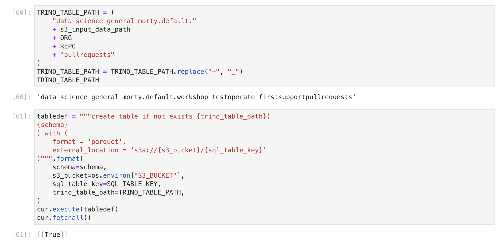
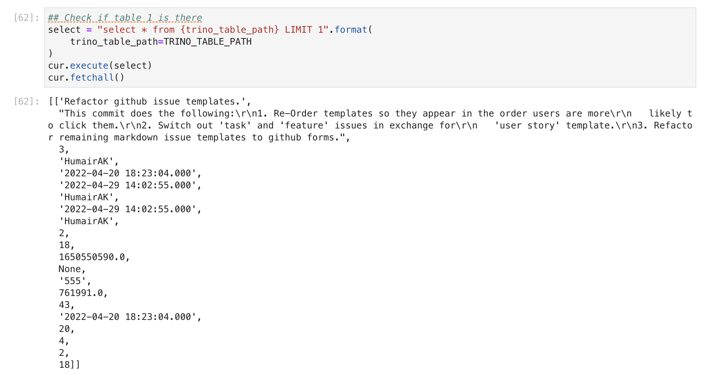
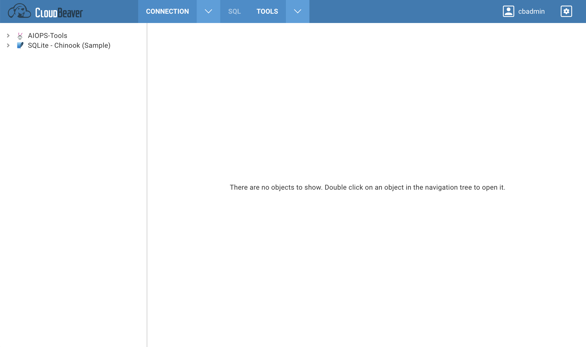
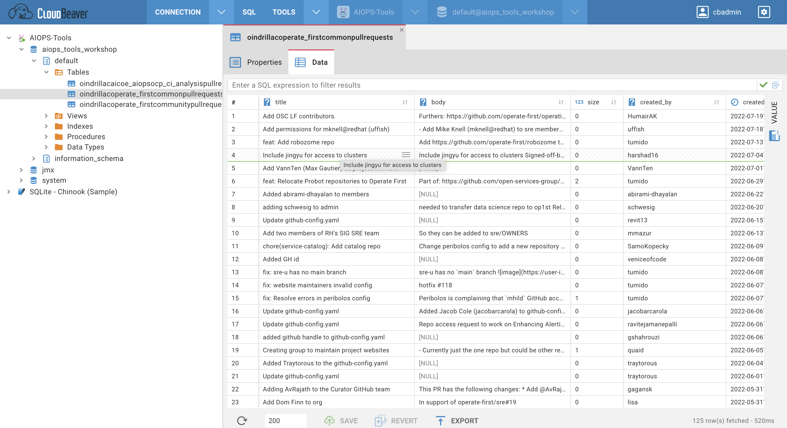

# Create SQL tables from pull requests dataset

We can also create interactive visualizations and charts on [Apache Superset](https://superset.apache.org/) using the data that we collect from Github Repositories. Our instance of Apache Supset is located [here](https://oauth-openshift.apps.smaug.na.operate-first.cloud/).

In this [chapter](./model_development.md) we saw how to collect data from Git repositories of interest, clean and process the raw data and train a model on the engineered dataset.

In order to create visualizations on Apache Superset, we will first create SQL tables using Trino SQL Engine.

For this section, you will need access to [Trino Database Engine](https://trino-aiops-tools-workshop.apps.smaug.na.operate-first.cloud) to view running queries and [Cloudbeaver](http://cloudbeaver-aiops-tools-workshop.apps.smaug.na.operate-first.cloud/) to view tables. If you dont have access already, refer to login instructions in the [onboarding chapter](./onboarding.md).

## Create Tables

In the [feature engineering notebook](../../notebooks/time-to-merge-prediction/workshop/02_feature_engineering.ipynb), we connect to the Trino database engine and create a table from within the notebook.

.

If you ran the [feature engineering notebook](../../notebooks/time-to-merge-prediction/workshop/02_feature_engineering.ipynb) or the pipeline in kubeflow, the table creation should have worked succesfully.

To verify that the table was created succesfully, you can check that from the notebook or the Cloudbeaver UI.

## Verify Created Table

To verify that the table was created, we run a `select query` from the notebook, like following.

.

To verify that it was created succesfully from the Cloudbeaver UI, login into [Cloudbeaver](http://cloudbeaver-aiops-tools-workshop.apps.smaug.na.operate-first.cloud/).

To locate the table that you created, navigate to navigation tree on the left, find the catalog `aiops_tools_workshop`, click on the schema `default` and under tables you should be able to see the table with your username. The table should have the same name that you set your environment variable `CEPH_BUCKET_PREFIX`.

Double click on the table and it should show the contents of the table.

Once you confirm that this table is created succesfully, you can move on to creating a Superset dashboard in the [next chapter](./visualization_dashboard.md)
