# Visualization Dashboard

So far we have seen how to collect Pull Requests data from a Git repository, processing the data, develop and deploy AIOps models. Now we will learn how to create interactive visualization dashboards using Apache Superset.

[Superset](https://superset-aiops-tools-workshop.apps.smaug.na.operate-first.cloud/) is an open source visualization tool that allows users to create interactive dashboards. Superset is very simple to use and may require some basic knowledge about SQL.
For this section, you will need access to [Apache Superset](https://superset-aiops-tools-workshop.apps.smaug.na.operate-first.cloud/) to create charts and dashboards. If you dont have access already, refer to login instructions in the [onboarding chapter](./onboarding.md).
Here's how you can access the Superset, create your own charts and dashboards.

1. First start by going to [Superset](https://superset-aiops-tools-workshop.apps.smaug.na.operate-first.cloud/) page and log in by clicking on `operate-first` using your github account.

2. After logging into Superset you will have to import the datasets you would want to visualize. Start by clicking on `Data` -> `Datasets` -> click on `+ Datasets` to start importing the data to superset from trino Database.

Import the dataset that you created in the [previous step](./sql_query_engine.md), it should be set to your username or have the same name that you set your environment variable `CEPH_BUCKET_PREFIX`.
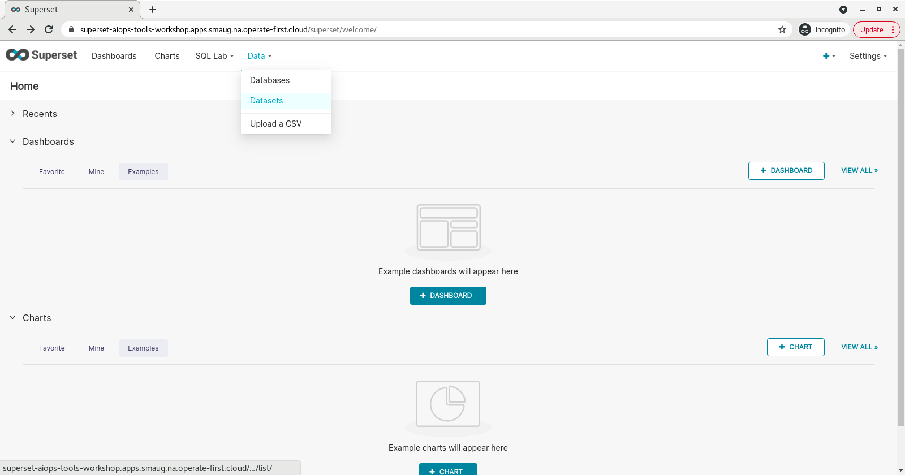

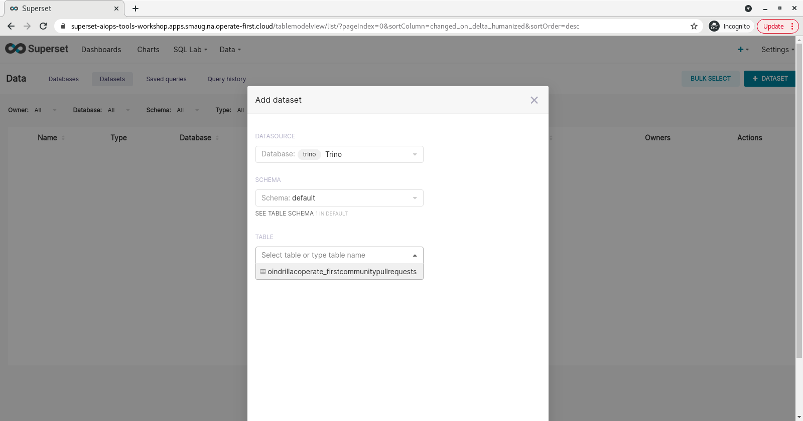

And after selecting this dataset, click `add`.

3. After having the datasets in place, we will move forward with creating visualizations.

* **Creating Charts** :

    * In order to create a chart, click on `Charts` tab on the top and add a new chart by clicking on the `+ Chart` button.
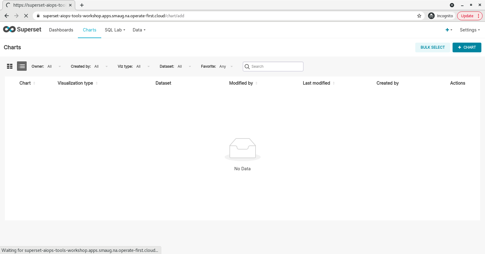

    * Now, choose a dataset from the dropdown and the type of visualization you would like to create.
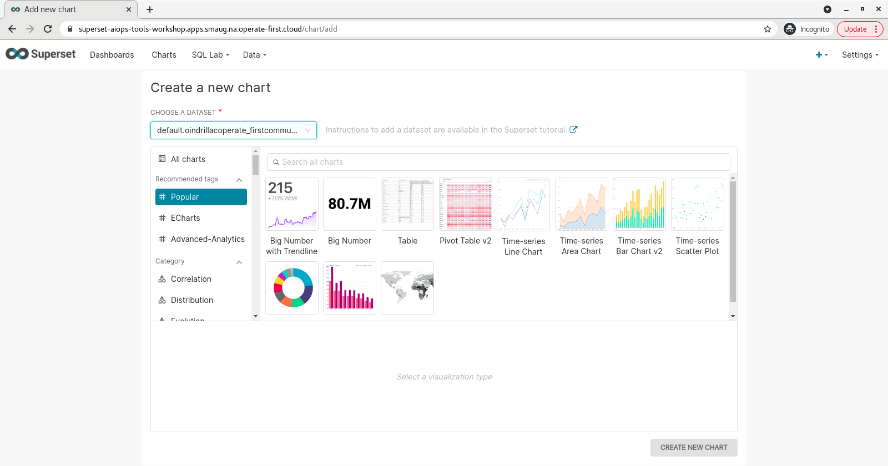
    * Based on the chart type you choose, you will have a number of fields to edit and write the appropriate SQL queries for visualizing your data. The fields are mostly self explanatory. “Metric” is the key data you are trying to convey (where you write your SQL queries). “Filters” allow you to specify which data is used. “Group by” combines the data into groups. After the chart has been adjusted as desired, click on the “Run” button to create it.
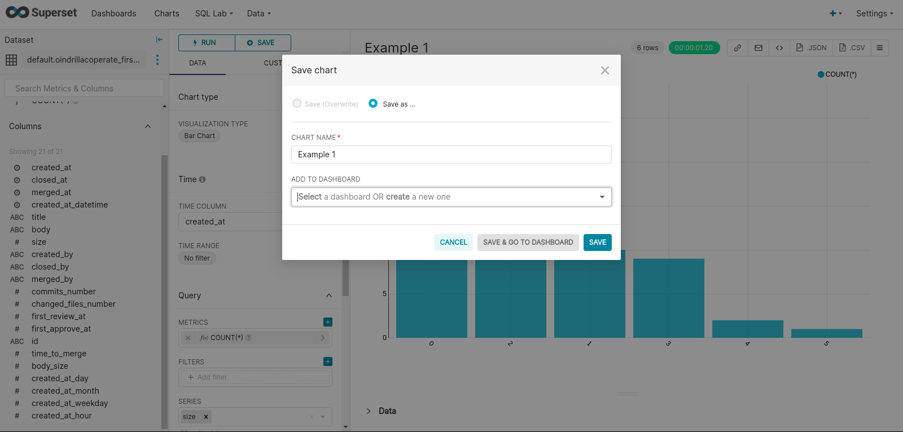

* **Creating Dashboards** :

Dashboards are a feature of Superset that allow for multiple charts and queries to be displayed in one place.

* To create a Dashboard, click on `Dashboards` on the top left corner, and now click `+ Dashboard` on the right to initiate a new Dashboard.

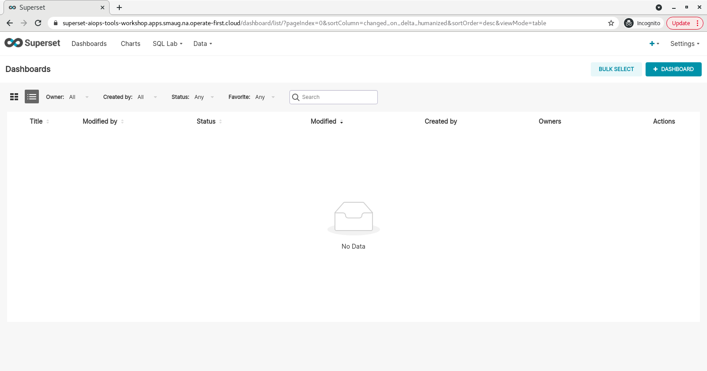

* This is how the dashboard would first look like, edit the `[ untitled dashboard]` to name it.

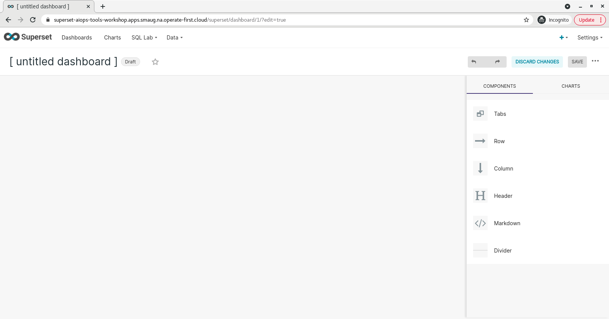

* Now, in order to import the chart we created earlier, go to `charts` like shown below and select the chart you created, drag it and place it in the dashboard.

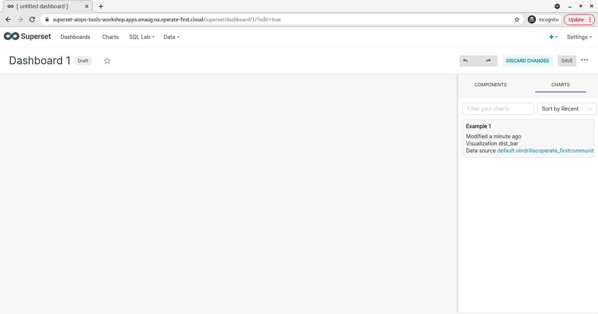

Here's how your dashboard would look like -
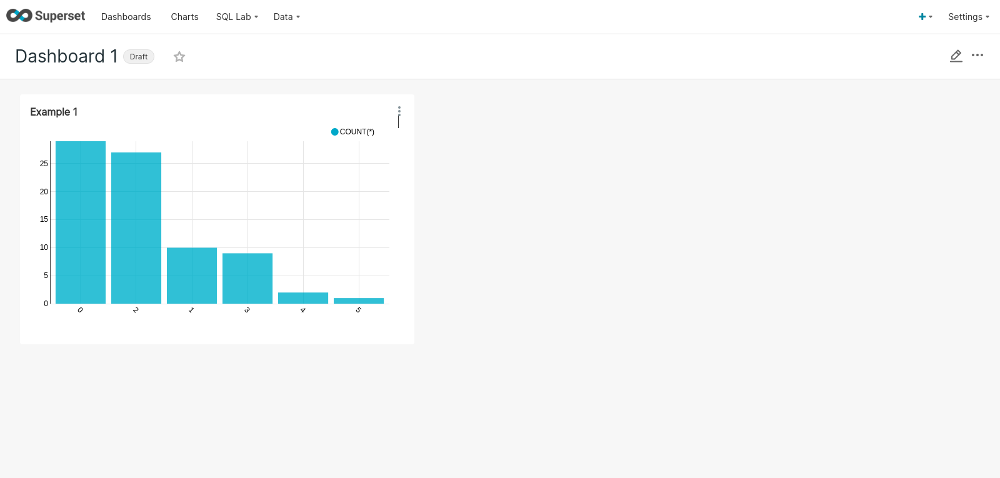

* To share your dashboard with others, make sure to click on `draft` next to the dashboard title name and change it to published by just clicking on it.

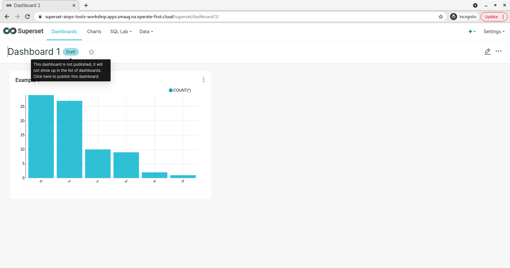

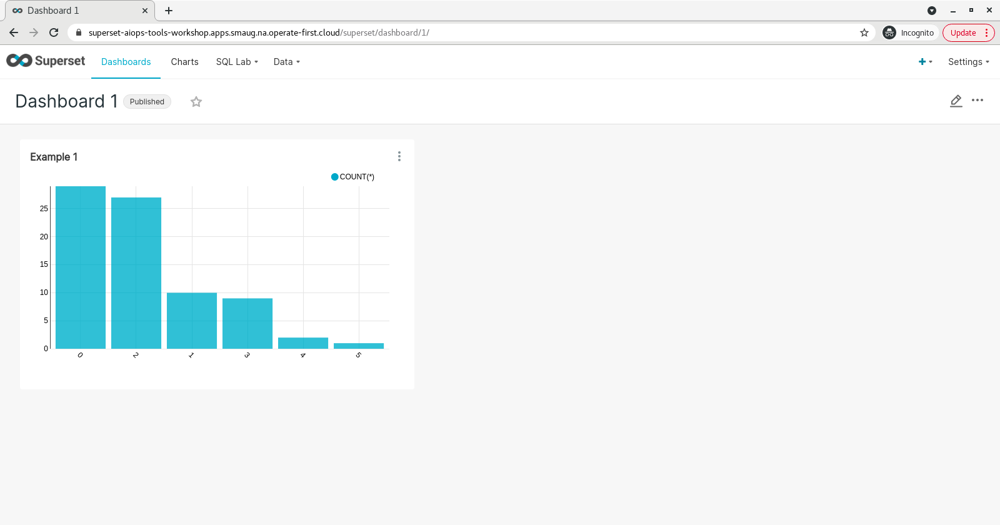

* And finally to export the dashboard you created, go to export a dashboard first go to the `Dashboards` tab of the top bar.  Next, hover under the `Actions` column next to the dashboard you would like to export. Finally, click on the `arrow icon` to export the dashboard and a JSON file download should start. Make sure that you have pop-ups enabled for this page or the download might not run.

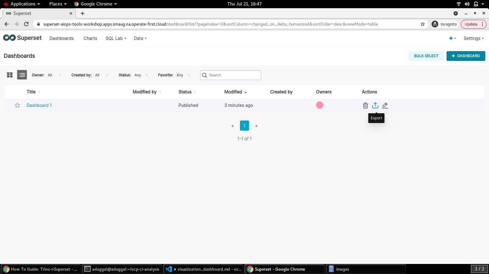

And that's it, now you have learnt how to create visualizations in Apache Superset using tables created from data collected from a Github repository.

To learn more about Superset and look at some already prepared Dashboards by our team:

* [AI4CI Dashboard](https://superset.operate-first.cloud/superset/dashboard/11/)
* [Insights from openhift origin PR](https://superset.operate-first.cloud/superset/dashboard/12/)
